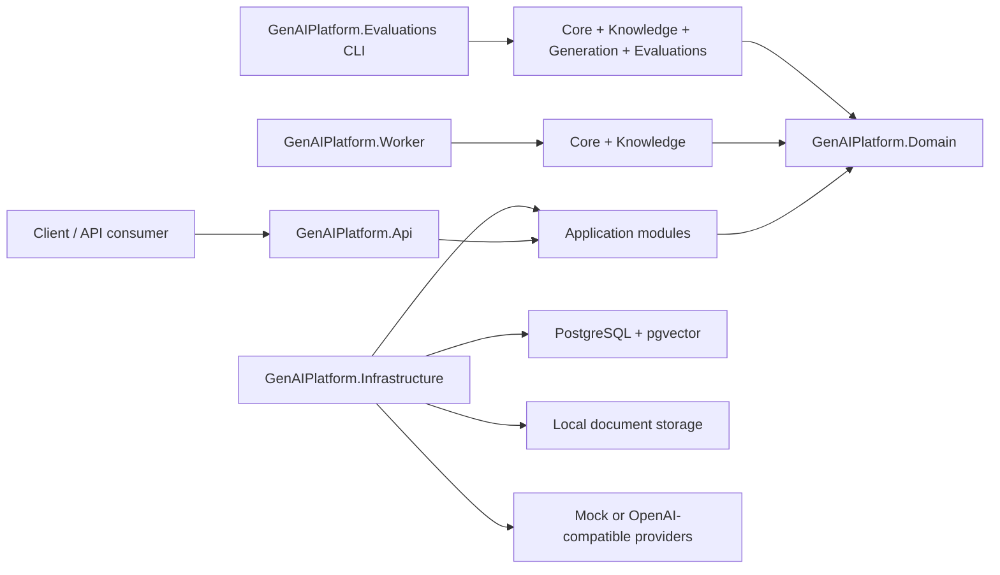

# .NET-native GenAI Platform Starter Kit

A .NET 10 reference implementation for a practical, secure backend platform layer around GenAI applications.

1. Upload [`samples/documents/demo-notes.md`](samples/documents/demo-notes.md) as a tenant-public document.
2. The Worker indexes it with the deterministic local mock providers.
3. Ask a RAG question and receive an answer with citation `[1]`.
4. Read the usage line for request count, tokens and estimated cost.


## Architecture



The project uses Clean Architecture with CQRS-lite where it improves clarity. API endpoints stay thin, Application modules own use cases and ports, Domain stays provider-agnostic, Infrastructure implements persistence/provider adapters, and Worker runs background jobs through the Core and Knowledge modules.

`GenAIPlatform.Mcp` adds a local stdio MCP host as the fourth consumption surface: REST for HTTP callers, Worker for background jobs, the Evaluations CLI for offline runs and MCP for AI clients. It exposes a bounded read-only tool set over existing Application use cases, including one governed safe Agentic tool that still goes through backend policy and audit.

External MCP servers are consumed separately by Infrastructure as Agentic tool sources. Their tools are not exposed through the local MCP host as a generic executor; they appear in the platform's agentic loop only after allow-listing, snapshotting, name prefixing and backend approval policy.

## What This Is Not

- Not a production-ready framework or a claim of production scale, live traffic or enterprise deployment.
- Not a no-code builder, SaaS platform or ML training platform; demo auth, mock providers and demo tools are intentionally replaceable adapters.

## Current Status

The `v0.3.0` reference release builds on the local stdio MCP host from `v0.2.0` with MCP client support for external stdio MCP servers. The implemented scope includes the solution skeleton, model gateway and prompt template foundation, document upload and DB-backed indexing, pgvector-backed RAG, sanitized AI request logs, pricing records, a usage endpoint, a shared API/CLI evaluation workflow, bounded agentic chat with backend-controlled demo tools, MCP tools over existing Application use cases, and configured external MCP tools routed through the same backend validation, policy, request-scoped simulated approval and audit path as built-in tools. The simulated approval flag is not a second-principal approval and pre-approves later risky calls selected by the model during that request.

The public sample path uses deterministic mock providers. OpenAI-compatible model and embedding adapters are included behind Application ports and covered by loopback integration tests, but this repository does not commit real-provider usage output because those runs depend on private credentials, account-specific provider behavior and sanitized local evidence.

## How This Was Built

Implementation and refactoring were heavily assisted by coding agents. Igor Lagutin owned the
product scope, architecture, task decomposition, acceptance criteria, review decisions and release
gates. Generated changes were treated as untrusted until the relevant build, tests, Docker scenarios,
code-organization checks and vulnerability gate passed.

Failures and trade-offs stay visible in the repository. The recorded real-model smoke results include
unsuccessful runs instead of presenting only the best outcome.

Start here:

- [Architecture](docs/architecture.md)
- [Application pipeline](docs/application-pipeline.md)
- [Versioning](docs/versioning.md)
- [Trade-offs](docs/trade-offs.md)

## Implemented Scope

- RAG with PostgreSQL + pgvector.
- Model gateway abstraction.
- Prompt template versioning.
- Permission-aware retrieval.
- Sanitized AI request logs, usage/cost tracking and documented observability extension points.
- Evaluation runner through API and CLI.
- Safe tool execution and bounded agentic chat.
- Local MCP host as a fourth consumption surface alongside REST, Worker and CLI.
- Configured external MCP tools routed through the same Agentic validation, policy, request-scoped simulated approval and audit path as built-in tools.
- Docker Compose local development.
- Clean/modular .NET architecture.

## Documentation

- [Quickstart](docs/quickstart.md)
- [RAG pipeline](docs/rag-pipeline.md)
- [Security model](docs/security-model.md)
- [Model gateway](docs/model-gateway.md)
- [Prompt versioning](docs/prompt-versioning.md)
- [Evaluations](docs/evaluations.md)
- [Cost tracking](docs/cost-tracking.md)
- [Safe tools](docs/safe-tools.md)
- [Agentic chat](docs/agentic-chat.md)
- [MCP host](docs/mcp.md)
- [Observability](docs/observability.md)
- [Local demo walkthrough](docs/local-demo.md)
- [v0.3.0 release notes](docs/release-notes-v0.3.0.md)
- [v0.2.0 release notes](docs/release-notes-v0.2.0.md)
- [v0.1.0 release notes](docs/release-notes-v0.1.0.md)

## Target Stack

- .NET 10 LTS.
- ASP.NET Core.
- PostgreSQL.
- pgvector.
- Docker Compose.
- OpenAI-compatible model and embedding clients.
- Mock model and embedding clients for tests.
- Sanitized AI request logs, usage/cost tracking and documented observability extension points.
- xUnit.
- Testcontainers for integration tests.

## Project Structure

```text
src/
  GenAIPlatform.Api
  GenAIPlatform.Application.Core
  GenAIPlatform.Application.Knowledge
  GenAIPlatform.Application.Generation
  GenAIPlatform.Application.Agentic
  GenAIPlatform.Application.Evaluations
  GenAIPlatform.Application.Usage
  GenAIPlatform.Domain
  GenAIPlatform.Infrastructure
  GenAIPlatform.Mcp
  GenAIPlatform.Worker
  GenAIPlatform.Evaluations
tests/
  GenAIPlatform.UnitTests
  GenAIPlatform.IntegrationTests
```

## Quickstart

See [docs/quickstart.md](docs/quickstart.md) for the full local setup, sample requests, demo identity headers and provider override examples.

Minimal local path:

```powershell
Copy-Item .env.example .env
dotnet restore GenAIPlatform.slnx
dotnet build GenAIPlatform.slnx
dotnet test GenAIPlatform.slnx
docker compose up -d postgres
```

Run the API and Worker in separate terminals. Set the connection string in each
terminal because PowerShell process environment variables are not shared across
new windows:

```powershell
$env:ConnectionStrings__GenAIPlatform = "Host=localhost;Port=5432;Database=genai_platform;Username=genai;Password=genai_dev_password"
dotnet run --project src/GenAIPlatform.Api --launch-profile http
```

```powershell
$env:ConnectionStrings__GenAIPlatform = "Host=localhost;Port=5432;Database=genai_platform;Username=genai;Password=genai_dev_password"
dotnet run --project src/GenAIPlatform.Worker
```

Sample HTTP requests are available in [src/GenAIPlatform.Api/GenAIPlatform.Api.http](src/GenAIPlatform.Api/GenAIPlatform.Api.http) and [samples/http/local-demo.http](samples/http/local-demo.http). The local demo file covers direct chat, document upload, RAG, usage, evaluations and agentic chat.
