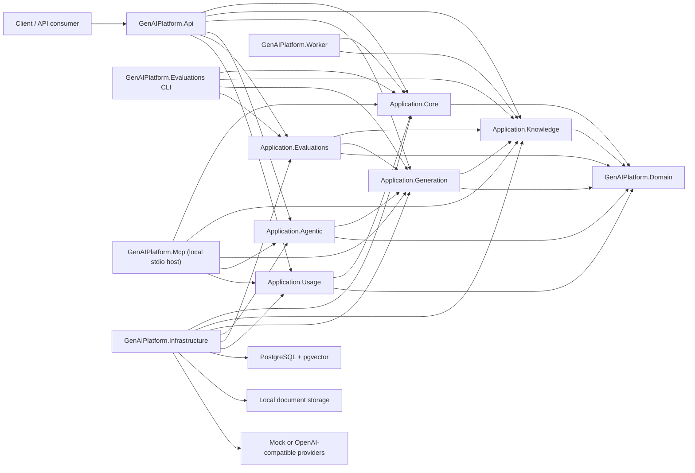

# Architecture

This project is a .NET-native GenAI platform starter kit. It demonstrates production-aware patterns, but it is not a framework with stable public extension contracts.

The implementation is a modular monolith. The application layer is split into project-level modules so hosts can compose only the capabilities they need:

## Projects

- `GenAIPlatform.Api`: HTTP endpoints, OpenAPI, demo auth adapter, request/response mapping.
- `GenAIPlatform.Application.Core`: dispatcher, pipeline behaviors, identity contracts, shared configuration, base errors, health echo, current-user use case, and shared model/embedding contracts.
- `GenAIPlatform.Application.Knowledge`: document upload/status/indexing/cleanup workflows, retrieval contracts, embedding options and document text extraction/chunking.
- `GenAIPlatform.Application.Generation`: model gateway options and policy, prompt rendering/templates, direct chat and RAG chat orchestration.
- `GenAIPlatform.Application.Agentic`: backend-governed tool contracts, tool policy/audit orchestration, agentic chat loop and budget checks.
- `GenAIPlatform.Application.Evaluations`: evaluation dataset provider, checks, run/summary use cases and evaluation repository contract.
- `GenAIPlatform.Application.Usage`: usage and cost reporting use case plus the usage repository contract.
- `GenAIPlatform.Domain`: simple domain records, enums and workflow state types shared by Application use cases. Documents, Prompts, Evaluations, Agentic and Observability concepts live here when they are domain concepts rather than application orchestration.
- `GenAIPlatform.Infrastructure`: PostgreSQL persistence adapters, pgvector retrieval, durable document storage cleanup queue, model clients, embedding clients, file storage, sanitized AI request logging, pricing/cost estimation and other adapters. Document ingestion and retrieval currently use raw Npgsql; EF Core remains optional for later persistence work.
- `GenAIPlatform.Mcp`: local stdio MCP host that composes Core, Knowledge, Generation, Agentic and Usage with Infrastructure, then exposes bounded tools over existing Application use cases. It is distinct from Infrastructure's external MCP client, which supplies governed Agentic tool sources and is not a generic executor exposed through the local host.
- `GenAIPlatform.Worker`: DB-backed background indexing jobs and orphaned document storage cleanup processing.
- `GenAIPlatform.Evaluations`: CLI runner for evaluation workflows.

## Rules

- Domain must not depend on Application modules, Infrastructure, Api, Worker, provider SDKs or persistence libraries.
- Application modules own use-case contracts, ports, orchestration, validation policies and pipeline behavior.
- Application module dependencies are one-way: Core references only Domain; Knowledge references Domain and Core; Generation references Domain, Core and Knowledge; Agentic references Domain, Core and Generation; Evaluations references Domain, Core, Knowledge and Generation; Usage references Domain and Core.
- Infrastructure implements application ports and owns the observability mechanism, including sanitized request logging, pricing/cost estimation and log/pricing persistence details.
- Hosts call explicit per-module registration methods instead of a root `AddApplication` composition method. The original `GenAIPlatform.Application` project is retired.
- API, Worker and CLI hosts should call application use cases instead of duplicating orchestration.
- Provider SDKs must not appear in controllers or use-case handlers.
- Keep the system a modular monolith for the starter-kit scope.
- Memory-only hosts can compose `Application.Core` and `Application.Knowledge` without `Application.Generation`, so retrieval and document-memory workflows do not require a chat model gateway.

## Style

Use Clean Architecture with Domain-owned records and enums for shared workflow concepts, and Application-owned orchestration, validation policies and pipeline behavior. FluentValidation is the request-validation framework, and the internal dispatcher runs pipeline behaviors for cross-cutting concerns such as request logging and validation before handlers execute. Use CQRS-lite where it improves clarity, but avoid separate read/write stores, event sourcing and ceremony that does not serve the starter kit.

Follow `docs/code-organization.md` for maintainability guardrails. In short: keep classes small, keep one entity per file, split unrelated responsibilities, and keep application handlers focused on use-case orchestration.
